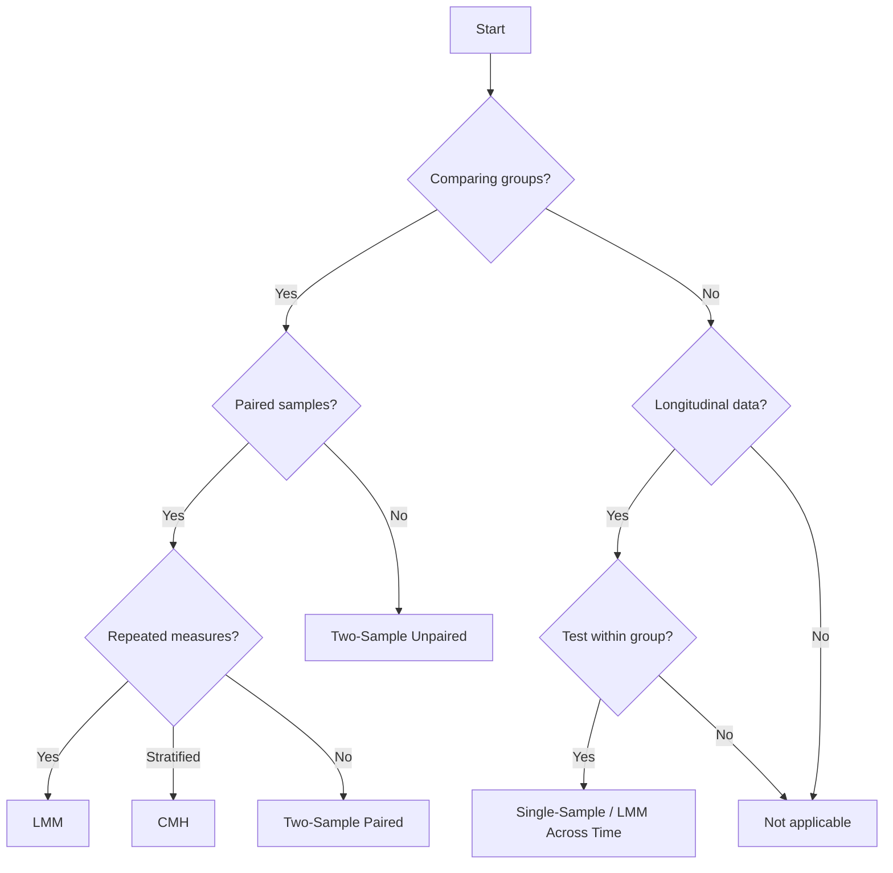

# Statistical Tests Reference

Comprehensive guide to AlleleFlux's statistical testing framework and score calculations.

## Overview

AlleleFlux provides multiple statistical tests to identify genomic positions under selection. Each test is designed for specific experimental designs and data types:

- **Between-group tests**: Compare allele frequencies between experimental groups (e.g., treatment vs. control)
- **Within-group tests**: Analyze changes within a single group over time
- **Longitudinal tests**: Account for repeated measures from the same individuals

:::{tip}
Enable tests in your config file under the `analysis` section:

```yaml
analysis:
  use_significance_tests: true  # Two-sample and single-sample tests
  use_lmm: true                 # Linear Mixed Models
  use_cmh: true                 # Cochran-Mantel-Haenszel
```

:::

## Summary of Available Tests

| Test Type | Data Type | Use Case | Paired Samples? |
| --------- | --------- | -------- | --------------- |
| **Two-Sample Unpaired** | Single or Longitudinal | Independent samples, different individuals per group | No |
| **Two-Sample Paired** | Longitudinal | Same individuals across timepoints/conditions | Yes |
| **LMM** | Longitudinal | Repeated measures with subject-level variation | Yes |
| **CMH** | Longitudinal | Stratified categorical analysis | Yes |
| **Single-Sample** | Longitudinal | Deviation from reference within one group | N/A |
| **LMM Across Time** | Longitudinal | Within-group temporal changes | Yes |
| **CMH Across Time** | Longitudinal | Within-group categorical changes over time | Yes |

---

## Between-Group Tests

### Two-Sample Unpaired Tests

**When to use:**

- You have **independent samples** from different individuals in each group
- Example: Treatment group (individuals A, B, C) vs. Control group (individuals D, E, F)

**Tests performed:**

- **Independent t-test**: Parametric test assuming normal distribution
- **Mann-Whitney U test**: Non-parametric alternative, robust to outliers

**Score calculation:**

```
Score (%) = (Number of Significant Sites / Total Sites) × 100
```

Where:

- **Significant sites**: Positions where p-value < threshold (default 0.05) for either t-test or Mann-Whitney
- **Total sites**: All positions analyzed after QC and preprocessing

**Interpretation:**

- Higher scores indicate more positions showing differential allele frequencies between groups
- Suggests stronger parallel evolution or selection

---

### Two-Sample Paired Tests

**When to use:**

- You have **paired samples** from the same individuals at different timepoints or conditions
- Example: Same individuals sampled before (pre) and after (post) treatment

**Tests performed:**

- **Paired t-test**: Parametric test on paired differences
- **Wilcoxon signed-rank test**: Non-parametric paired test

**Score calculation:**

```
Score (%) = (Number of Significant Sites / Total Sites) × 100
```

Where:

- **Significant sites**: Positions where p-value < threshold for either paired test
- **Total sites**: All positions analyzed

**Advantages over unpaired:**

- Controls for individual-level variation
- More statistical power when samples are truly paired

---

### Linear Mixed Models (LMM)

**When to use:**

- Longitudinal data with **repeated measurements** from the same individuals
- Want to account for **subject-level random effects**
- Complex experimental designs with multiple timepoints

**What it does:**

- Models allele frequency changes with group as a fixed effect
- Includes random intercepts for each subject (individual)
- Accounts for correlation between measurements from the same individual

**Score calculation:**

```
Score (%) = (Number of Significant Sites / Total Sites) × 100
```

Where:

- **Significant sites**: Positions where LMM p-value < threshold
- **Total sites**: All positions analyzed

**Advantages:**

- Properly handles repeated measures structure
- More robust to missing data
- Can model complex covariance structures

---

### Cochran-Mantel-Haenszel (CMH) Test

**When to use:**

- Testing association between group and allele while **controlling for strata** (e.g., subjects or timepoints)
- Categorical/stratified longitudinal data
- Want to detect consistent directional changes across strata

**What it does:**

- Tests association between group and allele frequency controlling for replicate/timepoint
- Detects consistent allele frequency differences across strata

**Score calculation (DIFFERENT from other tests):**

CMH uses **differential significance** between timepoints:

```text
1. Identify common sites: Positions present in BOTH timepoints
2. Count differential sites: Sites significant in focus timepoint 
   BUT NOT in the other timepoint
3. Score (%) = (Differential Significant Sites / Common Sites) × 100
```

**Detailed formula:**

```
Let:
  S_focus = {sites where p_CMH < threshold at focus timepoint}
  S_other = {sites where p_CMH < threshold at other timepoint}
  S_common = {sites present in both timepoints}

Differential sites = (S_focus - S_other) ∩ S_common
Score (%) = |Differential sites| / |S_common| × 100
```

**Interpretation:**

- Measures the **percentage of shared sites** that became significant only at the focus timepoint
- High scores indicate strong timepoint-specific selection
- Unlike other tests, this is **directional**: it matters which timepoint is the focus

**Focus timepoint:**

- The focus timepoint represents the **derived** or **later** state
- Always choose the **endpoint** or **later timepoint** as focus
- Example: For timepoints `[pre, post]`, set `focus: post`

---

## Within-Group Tests

These tests analyze changes **within a single experimental group** over time.

### Single-Sample Test

**When to use:**

- Testing if allele frequencies **deviate from the reference** within one group
- Longitudinal data where you want to test each group separately

**Test performed:**

- **One-sample t-test**: Tests if mean allele frequency differs from 0 (reference state)

**Score calculation:**

```
Score (%) = (Number of Significant Sites / Total Sites) × 100
```

**Interpretation:**

- Identifies positions evolving away from reference within a single group

---

### LMM Across Time

**When to use:**

- Within-group temporal changes with repeated measures
- Want to test if a single group shows significant change over time

**Score calculation:**

```
Score (%) = (Number of Significant Sites / Total Sites) × 100
```

---

### CMH Across Time

**When to use:**

- Within-group categorical changes over time
- Stratified analysis within one group

**Score calculation:**

```
Score (%) = (Number of Significant Sites / Total Sites) × 100
```

---

## General Score Calculation Details

### For Most Tests (Non-CMH)

The standard score formula applies to:

- Two-sample unpaired
- Two-sample paired
- LMM
- Single-sample
- LMM across time
- CMH across time

**Formula:**

```python
# For each test type:
for test_name in test_types:
    significant_sites = count(p_value < threshold)
    total_sites = count(all_analyzed_positions)
    score = (significant_sites / total_sites) * 100
```

**Output columns:**

- `total_sites_per_group_{test}`: Total positions analyzed
- `significant_sites_per_group_{test}`: Count passing threshold
- `score_{test} (%)`: Percentage of significant sites

### For CMH (Between-Group)

**Special differential calculation:**

```python
# Load CMH results for both timepoints
df_tp1 = load_cmh_results(timepoint1)
df_tp2 = load_cmh_results(timepoint2)

# Find common positions
common_sites = set(df_tp1[['contig','position']]) & set(df_tp2[['contig','position']])

# Identify significant sites at each timepoint
sig_focus = {(c,p) for c,p in focus_df if p_value_CMH < threshold}
sig_other = {(c,p) for c,p in other_df if p_value_CMH < threshold}

# Differential: significant in focus BUT NOT in other
differential = (sig_focus - sig_other) & common_sites

# Calculate score
score = (len(differential) / len(common_sites)) * 100
```

**Output columns:**

- `focus_timepoint`: Which timepoint was designated as focus
- `total_sites_per_group_CMH`: Number of common sites across both timepoints
- `significant_sites_per_group_CMH`: Differential significant sites
- `score_CMH (%)`: Percentage

---

## Choosing the Right Test



### Decision Table

| Your Data | Recommended Test |
|-----------|-----------------|
| Independent samples, one timepoint | Two-Sample Unpaired |
| Independent samples, multiple timepoints | Two-Sample Unpaired (on changes) |
| Paired samples, simple comparison | Two-Sample Paired |
| Paired samples, repeated measures | LMM |
| Stratified categorical data | CMH |
| Within-group deviation from reference | Single-Sample |
| Within-group temporal changes | LMM Across Time |

### Key Considerations

1. **Sample pairing**: If the same individuals are measured multiple times, use paired tests or LMM
2. **Data distribution**: For non-normal data, non-parametric tests (Mann-Whitney, Wilcoxon) are more robust
3. **Repeated measures**: LMM properly accounts for correlation between repeated measurements
4. **Stratification**: CMH is ideal when you want to control for strata (subjects, timepoints)
5. **Statistical power**: Paired tests generally have more power than unpaired when pairing is valid

---

## Configuration Examples

### Enable all tests (recommended)

```yaml
analysis:
  use_significance_tests: true
  use_lmm: true
  use_cmh: true
```

### Between-group comparison only

```yaml
analysis:
  use_significance_tests: true  # two-sample tests
  use_lmm: false
  use_cmh: false
```

### Focus on LMM and CMH

```yaml
analysis:
  use_significance_tests: false
  use_lmm: true
  use_cmh: true
```

---

## See Also

- [Configuration Reference](configuration.md) - Full config options
- [Output Files Reference](outputs.md) - Understanding test outputs
- [Interpreting Results](../usage/interpreting_results.md) - How to interpret scores
