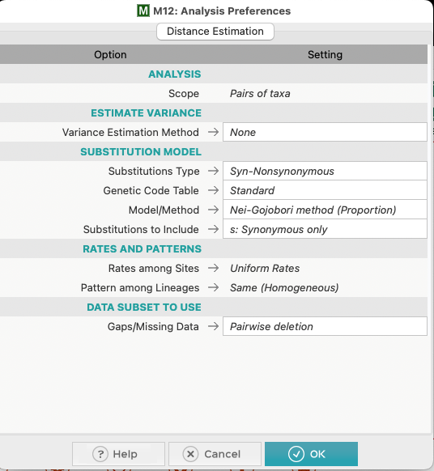

# MEGA vs. AlleleFlux (NG86) — Results & How-To

## Summary table

| Dataset | **MEGA** (Nei–Gojobori - Proportion) | | **AlleleFlux - New** (MAG level) | |
| ------- | -------------------------------------: | ----------: | ----------------------------------: | ----------------------: |
| | dS | dN | dS | dN |
| Mock 1 | 0.205 | 0.0759 | 0.1987 | 0.08437 |
| Mock 1 (geneA) | 0.195 | 0.101 | 0.1956 | 0.1011 |
| Mock 1 (geneB) | 0.219 | 0.0433 | 0.2027 | 0.0633 |
| Mock 2 | 0.179 | 0.0916 | 0.1827 | 0.100 |
| Mock 2 (geneA) | 0.213 | 0.108 | 0.210 | 0.108 |
| Mock 2 (geneB) | 0.140 | 0.0723 | 0.150 | 0.0911 |

> Notes

> • MEGA values above are taken with the **Nei–Gojobori (Proportion)** model, **Standard Genetic table** (Bacterial/Archaeal), and **pairwise** comparisons.

> • AlleleFlux values come from the NG86 **path-averaged** implementation at MAG level using the script (codon-event grouping, zero-based contig positions).

> • When running MEGA, you can also run individual gene files (e.g., just geneA or geneB) and compare the results with the per-gene summary (`*_gene_summary_ng86.tsv`) produced by AlleleFlux to validate gene-level dN/dS calculations.

---

## How to reproduce with **MEGA**

These steps assume you have the concatenated, codon-aligned pair FASTA you prepared for MEGA (e.g., `mega_pair_concat.fasta`).

1. **Open MEGA** (GUI).
2. **Data → Open a File/Session…**
   * Select `mega_pair_concat.fasta`. 
   * Chose **Analyze**.
   * When prompted, choose **DNA**.
   * Mark as **Coding DNA Sequence** (if not already).
   * **Select Genetic Code → Standard (Table 11)**.
4. **Distance → Compute Pairwise Distances**
   Adjust the dialog to the following. Run again with **n: Nonsynonymous only**.

    

5. **Compute**
   * MEGA will output pairwise **dS**.
   * Go through the Distance → Compute Pairwise Distances and change **Substitutions to Include** to **n: Nonsynonymous only**.
   * Repeat for the other dataset

> Tip: If you want an overall (single) dN and dS across multiple genes, concatenate the **coding** sequences in-frame and maintain codon alignment before importing into MEGA—exactly as you did.

---

## How to reproduce with **AlleleFlux NG86 script**

Assuming the following files/dirs (update paths to yours):

* `significant_sites.tsv` — from `p_value_summary.py`
* `pre_sample_MAG_001_profiled.tsv(.gz)` and `post_sample_MAG_001_profiled.tsv(.gz)` — from `profile_mags.py`
* `prodigal_genes.fasta` — Prodigal-predicted coding sequences (headers include start/end/strand)
* profiles are organized like:

  ```
  profiles/
    pre_sample/
      pre_sample_MAG_001_profiled.tsv.gz
    post_sample/
      post_sample_MAG_001_profiled.tsv.gz
  ```
* You want MAG `MAG_001` (add more IDs as needed)

### Command

```bash
python dnds_from_timepoints.py \
  --significant_sites significant_sites.tsv \
  --mag_ids MAG_001 \
  --p_value_column q_value \
  --p_value_threshold 0.05 \
  --test-type two_sample_paired_tTest \
  --ancestral_sample_id pre_sample \
  --derived_sample_id post_sample \
  --profile_dir profiles \
  --prodigal_fasta prodigal_genes.fasta \
  --outdir results \
  --prefix ancestral_dnds \
  --cpus 4 \
  --log-level INFO
```

### What the script does (key points)

* **Reconstructs ancestral ORFs** per gene using **major alleles in the ancestral profile** (ties broken in favor of the reference base; reverse-strand handled by complementing alleles).
* **Groups significant sites by codon** and builds **ancestral→derived codon** transitions.
* Applies **NG86 path averaging** for k=2/3 multi-position codon changes, excluding paths that pass through **intermediate stops**.
* Computes **fractional** `frac_S`/`frac_NS` per codon event and sums at **gene** and **MAG** levels.
* Uses **Genetic Code 11** consistently.
* **Coordinates**: contig positions in your outputs are **zero-based** (to match your pipeline). MEGA does not use genomic coordinates, only aligned sequences—so this doesn’t affect MEGA, but it must be consistent in your inputs and documentation.

### Outputs you’ll see in `results/MAG_001/`

* `ancestral_dnds_MAG_001_<test>_q_value_codon_events_ng86.tsv`
  One row per **codon event** with `ancestral_codon`, `derived_codon`, `frac_S`, `frac_NS`, `k`, `num_valid_paths`, etc.
* `ancestral_dnds_MAG_001_<test>_q_value_gene_summary_ng86.tsv`
  Per-gene `dN`, `dS`, and `dN/dS`.
* **IMP**: `ancestral_dnds_MAG_001_<test>_q_value_mag_summary_ng86.tsv`
  MAG-level totals and `dN`, `dS`, `dN/dS` **(these are the values compared to MEGA in the table)**.
* `ancestral_dnds_MAG_001_<test>_q_value_global_dnds_ng86_summary.tsv`
  A compact global summary (unique-codon potentials + fractional counts).
* `ancestral_dnds_MAG_001_<test>_q_value_ancestral_orfs.ffn`
  FASTA with **reconstructed ancestral coding sequences**.

---
